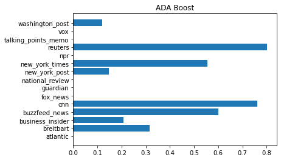

# Publisher Prediction: Natural Language Processing (NLP) with News Articles
The goal of this project was to attempt to create an NLP model which could correctly
identify the publisher given an article.

Along with supporting data and images in their respective folders, the project
uses two main files:
1. *articles_analysis.py*
2. *articles_functions.py*

**See also the [medium article](https://medium.com/@carlj.klein/publisher-prediction-natural-language-processing-nlp-with-news-articles-5e5dffe8c316).**

## Table of Contents
- [Libraries Used](#libraries-used)
- [Project Definition](#project-definition)
- [Functions](#functions)
- [Data Description](#data-description)
- [Methodology](#methodology)
- [Analysis](#analysis)
- [Results](#results)
- [Conclusion](#conclusion)


## Libraries Used
The following packages are required:
- numpy
- pandas
- matplotlib.pyplot
- nltk
- re
- sklearn


[Table of Contents](#table-of-contents)


## Project Definition
**Overview**
- Domain: News / Media
- Origin: Initial Attempt, Original Problem & Solution 
- Data: [Kaggle](https://www.kaggle.com/datasets/snapcrack/all-the-news)

**Statement**

After cleaning and exploring the data via statistical and visual methods, attempt to
create a classification model which will accurately predict publisher if given a news
article.

Without higher processing power, and a more equipt dataset, this will likely not be very
accurate. Additionally, this only accounts for a small portion of the thousands of
publishers and news networks, which means any article from outside the publishers in this
dataset will result in an incorrect prediction.

**Metrics**

Our main measures of model performance will be:
- *f1-score*
- *accuracy*

*Accuracy* is generally a good starting place, however *f1-score* has a slightly
deeper and more complex meaning.

[Table of Contents](#table-of-contents)


## Functions
The following are descriptions of the functions provided in the *articles_functions.py*
file.

**Load and Clean Data**

Functions:
- *load_data*: loads the combined and reduced dataset
- *clean_words*: lowercase the characters, remove punctuation and tidy spaces
- *variable_formatting*: format publisher column for use as variables
- *word_count*: counts the number of words in a given string (used for articles)
- *clean_data*: combines many of the above functions as well as removes unnecessary columns
    
**Model Creation**

Functions:
- *tokenize*: tokenizes text (i.e. each word becomes an element in a list), removes stop words,
and then lemmatizes text (i.e. puts words in their base form)
- *default_forest*: sklearn's RandomForestClassifier with all defaults, passed through
a pipeline along with *tokenize* and a TfidfTransformer, and returns DataFrame
containing the classification report
- *default_knn*: sklearn's KNeighborsClassifier with all defaults...
- *default_nb*: sklearn's MultinomialNB with all defaults...
- *default_svc*: sklearn's LinearSVC with all defaults...
- *default_ada*: sklearn's AdaBoostClassifier with all defaults...
- *build_model_forest*: builds on the RandomForestClassifier by passing several parameters
through a GridSearchCV object

[Table of Contents](#table-of-contents)


## Data Description
The data used in this analysis was found on [Kaggle](https://www.kaggle.com/datasets/snapcrack/all-the-news).

The author of the data used a BeautifulSoup webscraper to obtain articles and associated datapoints
from several different sources. The data was uploaded in three datasets:
- artices1.csv
- artices2.csv
- artices3.csv

The datasets contains about 50,000 articles each, and have (potentially) the following columns:
- ID
- title
- publication
- author
- date
- year
- month
- url
- content

The methodology section ahead will discuss cleaning and combining of the datasets, however,
the data used in the analysis was a combination of the three files reduced to a
total of 10,000 articles.

[Table of Contents](#table-of-contents)


## Methodology
**Data Preprocessing**

The webscraper used to procure the dataset did pretty well, however there were some
areas that needed help. We'll go through each column and describe what was found.
- **ID**: A tracking number which really had no relevance, and was subsequently dropped.
- **title**: This was trickier than it first appeared. Some of the titles had their publishers in their
text, such as "title_text - publisher". Initially, the intent was to remove this and just have the
title text. However, upon further inspection, some titles would reference counterpart publishers,
or would have publisher's names in the title referencing something not related to the publisher.
For example, the publisher "Atlantic" could be self-reference, a counterpart reference, or a reference
to something like an ocean. In lieu of that information, no parts were removed from the tiles.
- **publication**: This was probably the cleanest column of the dataset. It featured 15 publishers,
all of which were never restated with typos.
- **author**: This datapoint had quite a few missing values. In the complete dataset (around 150,000 articles),
there were about 11% of authors missing. Along with the missing values, sometimes the author would be 
the publisher, an organization, or consist of multiple authors. If it were more uniform, this could've had
more potential, however was ultimately dropped.
- **date**: Given the data was somewhat cherry picked and not uniform, this column didn't provide much
value and was subsequently dropped.
- **year**: Redundant with date, dropped.
- **month**: Redundant with date, dropped.
- **url**: High number of missing values, irrelevant information, dropped.
- **content**: This is what we were training our model on, and thus had quite a bit of time
spent on. We removed punctuation, extra and leading/trailing spaces. After this, we counted 
the words (tracked in the word_count column). There were quite a few articles whose content
was either blank or was scraped incorrectly. An example of an incorrect scrape that occurred frequently
was the scrape of "Advertisement". To account for this, we set a minimum word count of 30. Additionally,
there was a single article with a word count in the 50,000's which ended up being the entire 
James Comey testimony. With the next lowest having a word count in the 20,000's, we capped article
length at a word count of 50,000.

Due to size constraints in GitHub, and time/processor constraints with building an NLP model, the analysis
and model were built off a subset of the combined dataset at 10,000 articles.

In *articles_analysis*, all of the above is wittled down to the following:
```
# load data    
df = load_data()
# clean data
df = clean_data(df)
```

**Implementation**

After some exploration both statistically and visually (see Analysis section below), we
tested some classification models. The idea was to test a few different classifiers, and then run parameters through
GridSearchCV for the best performing model.

The general format of the default model testing was:
```
# Classifier
def default_classifier(X_train, X_test, y_train, y_test):
    '''
    INPUT:
        - X_train: training split from dataset, article text
        - X_test: testing split from dataset, article text
        - y_train: training split from dataset, network name
        - y_test: testing split from dataset, network name
    
    OUTPUT:
        - results: DataFrame of the model's classification report
    '''
    # pipeline with default Classifier
    pipeline = Pipeline([
        ('vect', CountVectorizer(tokenizer=tokenize)),
        ('tfidf', TfidfTransformer()),
        ('clf', Classifier())
        ])
    
    # train the classifier
    pipeline.fit(X_train, y_train)
    
    # test the classifier and calculate the results
    y_pred = pipeline.predict(X_test)
    results = classification_report(y_test, y_pred, output_dict=True)
    results = pd.DataFrame(results).transpose()
    
    # return the classification report as a dataframe
    return results
```

We tested several models, ultimately running the code in *articles_analysis*:
```
# split data into training and testing sets
X = df['content']
y = df['publication']
X_train, X_test, y_train, y_test = train_test_split(X, y, test_size=0.2, random_state=21)

# before testing parameters, we'll take a look at a few different default classifiers
# Random Forest Classifier
results_rfc = default_forest(X_train, X_test, y_train, y_test)

# K-Nearest-Neighbors
results_knn = default_knn(X_train, X_test, y_train, y_test)

# Naive Bayes (requires dense matrix)
results_nb = default_nb(X_train, X_test, y_train, y_test)

# Linear Support Vector Classification (requires dense matrix)
results_svc = default_nb(X_train, X_test, y_train, y_test)

# ADA Boost
results_ada = default_ada(X_train, X_test, y_train, y_test)
```
See results in the Analysis and Results sections.

[Table of Contents](#table-of-contents)


## Analysis
**Data Exploration & Visualization**

```
# number of articles per publisher
# analysis
publishers = df.publication.value_counts(ascending = True)
# plotting
plt.barh(y = publishers.index, width = publishers)
plt.title('Number of Articles per Publisher')
```


Something to note about this are the large differences in the amount of articles between
the publishers. Unfortunately, the data coulnd't be scraped in an evenly distributed manner.
Would this skew the results?

```
# word count statistics per publisher
# analysis
avg_words = df.groupby('publication')['word_count'].mean().sort_values(ascending = True)
min_words = df.groupby('publication')['word_count'].min().sort_values(ascending = True)
max_words = df.groupby('publication')['word_count'].max().sort_values(ascending = True)
```

```
# plotting
plt.barh(y = avg_words.index, width = avg_words)
plt.title('Average Word Count per Publisher')
```


```
plt.barh(y = max_words.index, width = max_words)
plt.title('Maximum Word Count per Publisher')
```


```
plt.barh(y = min_words.index, width = min_words)
plt.title('Minimum Word Count per Publisher')
```


Note that the order of the publishers changes between each of these images. Additionally,
it's important to draw attention to how a few of the publisher's minimum word count far exceeded
the others. Could article length play a deterministic role in the model?

```
# word count histograms
# full set
df.word_count.hist()
plt.title('Histogram of Word Count - Full Set')
plt.xlabel('Word Count')
plt.ylabel('Article Count')
```


```
# 6,000 word limit
df[df.word_count<6000].word_count.hist()
plt.title('Histogram of Word Count - 6,000 Word Limit')
plt.xlabel('Word Count')
plt.ylabel('Article Count')
```


```
# 3,000 word limit
df[df.word_count<3000].word_count.hist()
plt.title('Histogram of Word Count - 3,000 Word Limit')
plt.xlabel('Word Count')
plt.ylabel('Article Count')
```


In each progressive histogram, we reduce the x-axis limits to focus in on where the
majority of data is. We can see the histogram of the word counts has a significant right skew,
with an average right around 500 words.


This starts to give us an idea of how number of articles and word counts potentially play
a role in prediction among publisher.

[Table of Contents](#table-of-contents)


## Results
**Model Evaluation & Validation**

After cleaning and exploring the data, we're ready to test some classification models.

The reiterate, the idea was to test a few classification models with their default parameters,
and then take the most favorable model to test further parameters.

The following models were tested:
- *default_forest*
- *default_knn*
- *default_nb*
- *default_svc*
- *default_ada*


We followed the f1-score and accuracy through the testing.

From the classification reports, here are the f1-scores for each model visualized:





**Justification**

Following the f1-scores and accuracies, the Random Forest Classifier is the obvious winner.

In lieu of this, utilizing GridSearchCV, we tried to improve the Random Forest Classifier by
implementing and testing more parameters.

Unfortunately, due to the amount of time it takes to test these parameters, only a few instances
of "max_depth" were tested:
```
def build_model_forest():
    # pipeline
    pipeline = Pipeline([
        ('vect', CountVectorizer(tokenizer=tokenize)),
        ('tfidf', TfidfTransformer()),
        ('clf', RandomForestClassifier())
        ])
    
    # parameters
    parameters = {
        'clf__max_depth': [1, 5, 10]
        }
    
    # optimize
    cv = GridSearchCV(pipeline, param_grid=parameters, n_jobs=1, verbose=3, cv=2)
    
    return cv
```
Surprisingly, the result was worse off than default parameters:


In conclusion, the accuracies across every model:


[Table of Contents](#table-of-contents)


## Conclusion
**Reflection**

Overall, we were able to successfully clean and analyze a dataset surrounding our goal. After testing
several models and parameters, there was a "best" model built. The f1-scores and accuracy were not
ideal, however, the framework to continue to improve this model has been created!

**Improvements**

When it comes to potential improvements of this analysis and model, at the top of the list is obviously
creating more accurate predictions. A starting point would be to perform a more robust parameter search.
Given the proper hardware, it would be great to test the entire dataset (~150,000 articles) across not only
each of the classifiers, but a grid search of parameters for each of the classifiers as well.

Unfortunately, the instance of testing just the 3 max_depth parameters for the Random Forest Classifier
on less than 10,000 rows of data took about 2 hours on the machine it was performed on. Maybe another machine is
better equipt to take on the challenge!

Aside from processor power, a few other areas of improvement would be:
- Scraping program: improve on the author collection, add more publishers, location origins, etc.
- Add a category datapoint: it's also not too plausible to create a model that could guess a publisher
we don't have any data for (there are thousands more than the 15 in this analysis), so a suggested
new datapoint would be category. Even within publishers, a sports author is going to
produce vastly (assumed) different patterns than a political writer.

[Table of Contents](#table-of-contents)